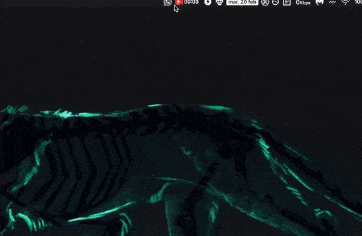

# WhatsBar 📱



Run WathsApp Web right from the Taskbar(Win) or from the Menubar(macOS).

## How To Use

* Install depencencies: `npm i`

* Run: `npm start`

## The code ~~Simple AF ¯\\\_(ツ)\_/¯~~

```javascript
const electron = require('electron');
const mb = require('menubar');

var config = {
  index: "https://web.whatsapp.com/",
  tooltip: "WhatsBar",
  icon: __dirname + "/icon.png",
  width: 760,
  height: 540
}

var menubar = mb(config);
```

## Download links:

* Windows: [https://github.com/JorgeCoke/WhatsBar/releases/download/v1.0/WhatsBar-win32-ia32.zip](https://github.com/JorgeCoke/WhatsBar/releases/download/v1.0/WhatsBar-win32-ia32.zip)

* macOS: [https://github.com/JorgeCoke/WhatsBar/releases/download/v1.0/WhatsBar-darwin-x64.zip](https://github.com/JorgeCoke/WhatsBar/releases/download/v1.0/WhatsBar-darwin-x64.zip)

---

⚡️ Powered by [Electron](http://electron.atom.io/) && [menubar](https://github.com/maxogden/menubar)

💻 [jorgecoke.github.io](https://jorgecoke.github.io/)

<sub><sup>💡 COMPLETELY UNRELATED to [https://github.com/fscherwi/WhatsBar](https://github.com/fscherwi/WhatsBar)</sup></sub>